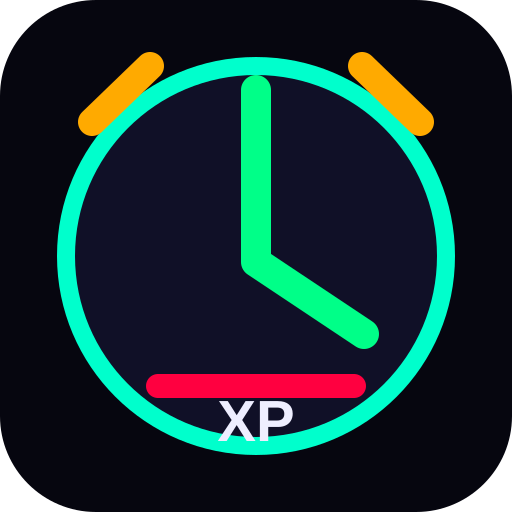

<div align="center">



# ⚔️ LEVEL UP

### Turn your daily tasks into an RPG progression system

Earn XP. Complete quests. Build streaks. Stop losing boss fights to procrastination.


</div>

---

## 🎮 What is LEVEL UP?

LEVEL UP transforms task management into a progression-based productivity game.

Instead of checking off boring to-do items like a spreadsheet accountant from 2007, you gain XP, track achievements, build streaks, and watch your progress grow over time.

Every completed task contributes to your overall progression.

---

## ✨ Features

### 📋 Quest-Based Task Management

- Create and organize tasks
- Task descriptions and notes
- Subtasks support
- Difficulty ratings
- Completion tracking
- Detailed task history

### ⏳ Built-In Pomodoro System

- 25-minute focus sessions
- 5-minute break cycles
- Automatic mode switching
- Session tracking
- Focus time analytics

### ⭐ XP & Leveling

- Earn XP for completed tasks
- Dynamic XP rewards based on difficulty
- Easy tasks give reduced XP
- Normal tasks provide base XP
- Hard tasks grant bonus XP
- Track progression across levels

### 🏆 Achievements

Unlock milestones as you progress.

Examples:

- First task completed
- Focus streaks
- XP milestones
- Productivity achievements

### 📈 Analytics Dashboard

Track your growth with:

- XP history graph
- Task completion statistics
- Heatmap activity view
- Task type breakdowns
- Productivity trends

### 📱 Progressive Web App

- Installable on desktop and mobile
- Offline-ready
- Custom app icons
- Service worker caching
- App-like experience

---

## 🖼️ Preview

> Space left for a screenshot in the future.

```text
Level 12
██████████████░░░░ 78%

Today's Quests:
✓ Finish project proposal
✓ 2 Pomodoro sessions
□ Review pull requests

+240 XP Earned
```

---

## 🚀 Getting Started

### Clone

```bash
git clone https://github.com/radiating-pumpkin0Zed/levelup-alarm.git
cd levelup-alarm
```

### Run

If using a local server:

```bash
npm install
npm run dev
```

Or serve the project using your preferred static server.

---

## 🎯 XP System

| Difficulty | XP Reward |
|------------|-----------:|
| Easy | Reduced XP |
| Normal | Base XP |
| Hard | Bonus XP |

The harder the challenge, the greater the reward.

Just like life, except this version actually shows you the numbers.

---

## 📊 Productivity Philosophy

LEVEL UP is built around a simple idea:

> Consistency beats motivation.

Small daily wins accumulate into meaningful long-term progress.

The app makes that progress visible.

---

## 🛠️ Tech Stack

- HTML
- CSS
- JavaScript
- Service Workers
- Web App Manifest
- Local Storage

---

## 📱 PWA Support

Install LEVEL UP directly from your browser.

Features include:

- Offline access
- Home screen installation
- Fast loading
- Native-app feel

---

## 🗺️ Roadmap

- [ ] Cloud sync
- [ ] User accounts
- [ ] Custom themes
- [ ] Skill trees
- [ ] Daily quests
- [ ] Leaderboards
- [ ] Export/import data
- [ ] Mobile enhancements

---

## 🤝 Contributing

Pull requests are welcome.

If you've found a bug, have an idea, or simply wish to increase the global supply of productive nerds, open an issue.

---

<div align="center">

## ⚡ Every task completed is XP earned.

### Stop managing tasks.
### Start gaining levels.

</div>
